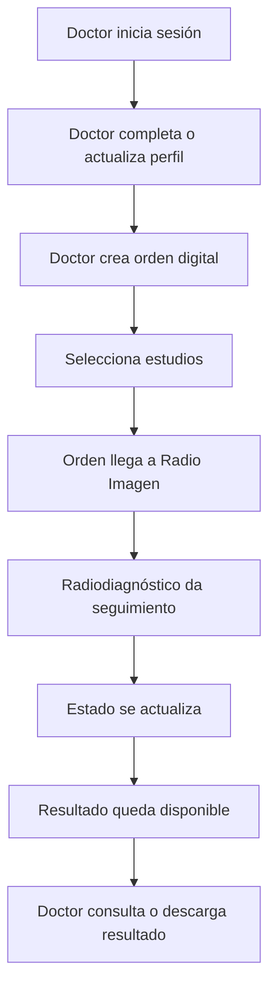

# Documento maestro - Radio Imagen Dentomaxilar

Este documento consolida la documentación principal del proyecto: visión del producto, lógica de información, estructura de datos y registro de cambios.

## 1. Resumen del proyecto

Radio Imagen Dentomaxilar será una plataforma donde los doctores generan órdenes digitales para estudios radiológicos y Radio Imagen/Radiodiagnóstico da seguimiento operativo hasta que el resultado esté listo.

La primera etapa está enfocada en:

- Portal del doctor.
- Login con correo o Google.
- Perfil profesional del doctor.
- Captura de órdenes digitales.
- Selección de estudios.
- Seguimiento de órdenes.
- Consulta de resultados.
- Lógica interna para que Radio Imagen dé seguimiento a cada orden.

## 2. PDR - Radio Imagen Dentomaxilar

### Objetivo del producto

Crear una plataforma para que doctores y clínicas puedan generar órdenes digitales de estudios radiológicos, mientras Radio Imagen/Radiodiagnóstico puede recibirlas, darles seguimiento operativo y actualizar su estado hasta que el resultado esté listo.

El producto reemplaza la dependencia de una orden física perdida o incompleta por un flujo digital trazable.

### Alcance actual

Incluido:

- Login del doctor con correo o Google.
- Perfil profesional del doctor.
- Imagen de perfil con ajuste de zoom y encuadre.
- Panel del doctor.
- Creación de orden digital.
- Selección de estudios solicitados.
- Fecha de remisión automática con opción de edición.
- Vista de órdenes referidas por el doctor.
- Popup para ver una orden específica.
- Consulta de resultados desde la vista del doctor.
- Métricas básicas del doctor/clínica.

No incluido todavía:

- Integración PACS.
- App móvil nativa.
- Agenda completa.
- Finanzas del doctor.
- Automatización avanzada de WhatsApp.
- Portal del paciente.
- Expediente clínico completo.

### Usuarios

Doctor:

- Crea órdenes de estudios.
- Revisa sus órdenes enviadas.
- Consulta estado de cada orden.
- Descarga o accede a resultados cuando estén listos.
- Edita su perfil profesional.

Radio Imagen / Radiodiagnóstico:

- Recibe órdenes generadas por doctores.
- Valida datos del paciente.
- Contacta o agenda al paciente.
- Actualiza el estado operativo de la orden.
- Sube o asocia resultados.
- Tiene trazabilidad por doctor, paciente, estudio y fecha.

### Flujo funcional actual



### Estados de una orden

| Estado | Responsable | Descripción |
| --- | --- | --- |
| recibida | Sistema / Radio Imagen | Orden creada por el doctor y visible para operación |
| en_revision | Radio Imagen | Datos revisados antes de contactar/agendar |
| agendada | Radio Imagen | Paciente ya tiene cita |
| en_proceso | Radio Imagen | Estudio realizado o en preparación de resultado |
| lista | Radio Imagen | Resultado disponible |
| entregada | Sistema / Doctor | Resultado descargado o consultado |
| cancelada | Radio Imagen | Orden no continúa |

### Reglas del producto

- Cada doctor solo debe ver sus propias órdenes.
- La fecha de remisión se autollenará con la fecha actual.
- El doctor puede modificar la fecha si está capturando una orden atrasada.
- Una orden puede contener uno o varios estudios.
- Una orden puede contener paquetes de estudios, como Estudio Ortodóntico Completo 2D o 3D.
- El Estudio Ortodóntico Completo debe capturar análisis cefalométrico e indicaciones especiales cuando existan.
- Al enviar su primer paciente, el doctor se convierte automáticamente en `Socio Radio Imagen Dentomaxilar`.
- Cada paciente referido suma puntos y puede subir al doctor de nivel.
- El nivel principal se calcula por pacientes referidos: 1, 5, 10, 25 y 50.
- Radio Imagen debe conservar historial de cambios de estado.
- Los resultados pertenecen a una orden, no directamente al doctor.
- La imagen del perfil debe guardar archivo y datos de encuadre.

### Métricas iniciales

- Órdenes activas.
- Pacientes referidos por periodo.
- Pendientes de cita.
- Estudio más solicitado.
- Conversión de órdenes a estudios atendidos.
- Resultados listos pendientes de descarga.

## 3. Lógica de información

### Principio central

```text
Doctor crea orden -> Radio Imagen recibe -> Radiodiagnóstico da seguimiento -> Doctor consulta estado/resultado
```

El doctor no administra el flujo interno. Solo crea órdenes, consulta sus órdenes y accede a resultados.

Radio Imagen/Radiodiagnóstico sí administra estados, agenda operativa, carga de resultados y seguimiento.

### Objetos principales

Doctor:

- Nombre profesional.
- Especialidad.
- Clínica.
- Correo.
- Teléfono.
- Imagen de perfil.
- Preferencias operativas para Radio Imagen.

Paciente:

- Nombre completo.
- Fecha de nacimiento.
- Teléfono.
- Doctor que lo refiere.
- Clínica de origen.

Orden:

- Folio.
- Doctor.
- Clínica.
- Paciente.
- Fecha de remisión.
- Estudios solicitados.
- Indicaciones clínicas.
- Estado actual.
- Historial de estado.

Estudio:

- Nombre del estudio.
- Categoría.
- Precio opcional.
- Estado activo/inactivo.
- Indicaciones o preparación opcional.

Resultado:

- Orden relacionada.
- Nombre del archivo.
- URL o ubicación.
- Tipo de archivo.
- Fecha de carga.
- Fecha de descarga/consulta.

### Lógica de permisos

Doctor puede:

- Ver su perfil.
- Editar su perfil.
- Crear órdenes.
- Ver solo sus órdenes.
- Ver estado de sus órdenes.
- Descargar resultados de sus órdenes.

Doctor no puede:

- Ver órdenes de otros doctores.
- Cambiar estados internos.
- Subir resultados.
- Editar catálogo de estudios.

Radio Imagen/Radiodiagnóstico puede:

- Ver todas las órdenes.
- Filtrar por doctor, clínica, estado y fecha.
- Cambiar estado de una orden.
- Agregar notas internas.
- Subir resultados.
- Marcar resultado como listo.
- Consultar métricas operativas.

Administrador puede:

- Administrar doctores.
- Administrar clínicas.
- Administrar catálogo de estudios.
- Administrar usuarios internos.
- Consultar reportes globales.

### Flujo de creación de orden

1. Doctor inicia sesión.
2. Sistema carga `doctor_profile`.
3. Doctor llena datos del paciente.
4. Sistema crea o reutiliza paciente.
5. Doctor selecciona estudios.
6. Sistema crea `order`.
7. Sistema crea registros en `order_studies`.
8. Sistema crea primer evento en `order_status_events` con estado `recibida`.
9. Radio Imagen ve la orden en bandeja de seguimiento.

### Flujo de seguimiento por Radiodiagnóstico

1. Radio Imagen abre bandeja de órdenes.
2. Filtra órdenes nuevas o pendientes.
3. Revisa información del paciente.
4. Cambia estado según avance:
   - `recibida`
   - `en_revision`
   - `agendada`
   - `en_proceso`
   - `lista`
   - `entregada`
   - `cancelada`
5. Cada cambio crea un evento histórico.
6. Si el resultado está listo, se crea un registro en `results`.
7. El doctor ve la orden como lista y puede descargar resultado.

## 4. Estructura de base de datos

### users

Usuarios que pueden iniciar sesión.

| Campo | Tipo | Nota |
| --- | --- | --- |
| id | uuid | Primary key |
| email | text | Único |
| auth_provider | text | email, google |
| role | text | doctor, clinic_admin, radio_admin |
| created_at | timestamp | Fecha de alta |
| last_login_at | timestamp | Último acceso |

### clinics

Clínicas o consultorios.

| Campo | Tipo | Nota |
| --- | --- | --- |
| id | uuid | Primary key |
| name | text | Nombre comercial |
| phone | text | Opcional |
| email | text | Opcional |
| city | text | Ciudad |
| address | text | Dirección |
| created_at | timestamp | Fecha de alta |

### doctors

Perfil profesional del doctor.

| Campo | Tipo | Nota |
| --- | --- | --- |
| id | uuid | Primary key |
| user_id | uuid | FK users.id |
| clinic_id | uuid | FK clinics.id |
| professional_name | text | Ej. Dra. Sofia Herrera |
| specialty | text | Ortodoncia, endodoncia, etc. |
| phone | text | Contacto |
| photo_url | text | Imagen de perfil |
| photo_crop | jsonb | zoom, x, y |
| notes_for_radio | text | Preferencias operativas |
| created_at | timestamp | Fecha de alta |
| updated_at | timestamp | Última edición |

### radio_staff

Usuarios internos de Radio Imagen/Radiodiagnóstico.

| Campo | Tipo | Nota |
| --- | --- | --- |
| id | uuid | Primary key |
| user_id | uuid | FK users.id |
| full_name | text | Nombre del colaborador |
| department | text | recepción, radiología, administración |
| active | boolean | Usuario activo |

### patients

Pacientes del doctor o clínica.

| Campo | Tipo | Nota |
| --- | --- | --- |
| id | uuid | Primary key |
| clinic_id | uuid | FK clinics.id |
| doctor_id | uuid | FK doctors.id |
| full_name | text | Puede ser anónimo en pruebas |
| birth_date | date | Fecha de nacimiento |
| phone | text | Opcional |
| created_at | timestamp | Fecha de registro |

### studies

Catálogo de estudios.

| Campo | Tipo | Nota |
| --- | --- | --- |
| id | uuid | Primary key |
| name | text | Ortopantomografía, Carpal, NEMOCEF RICKETS, etc. |
| category | text | Radiografías, fotografía/modelos, análisis cefalométrico |
| base_price | numeric | Para KPIs financieros |
| estimated_duration_minutes | integer | Operación |
| active | boolean | Catálogo vigente |
| config | jsonb | Reglas especiales como FOV y campos requeridos |

### orders

Orden digital referida a Radio Imagen.

| Campo | Tipo | Nota |
| --- | --- | --- |
| id | uuid | Primary key |
| order_number | text | Folio visible |
| clinic_id | uuid | FK clinics.id |
| doctor_id | uuid | FK doctors.id |
| patient_id | uuid | FK patients.id |
| referral_date | date | Autollenada con fecha del día |
| status | text | recibida, en_revision, agendada, en_proceso, lista, entregada, cancelada |
| clinical_notes | text | Indicaciones del doctor |
| internal_notes | text | Notas visibles solo para Radio Imagen |
| created_at | timestamp | Fecha real de creación |
| updated_at | timestamp | Última modificación |

### order_status_events

Historial de seguimiento de cada orden.

| Campo | Tipo | Nota |
| --- | --- | --- |
| id | uuid | Primary key |
| order_id | uuid | FK orders.id |
| previous_status | text | Estado anterior |
| new_status | text | Estado nuevo |
| changed_by_user_id | uuid | FK users.id |
| note | text | Comentario opcional |
| created_at | timestamp | Fecha del cambio |

### order_assignments

Asignación interna de seguimiento.

| Campo | Tipo | Nota |
| --- | --- | --- |
| id | uuid | Primary key |
| order_id | uuid | FK orders.id |
| staff_id | uuid | FK radio_staff.id |
| assigned_at | timestamp | Fecha de asignación |
| completed_at | timestamp | Fecha de cierre |

### order_studies

Relación muchos-a-muchos entre órdenes y estudios.

| Campo | Tipo | Nota |
| --- | --- | --- |
| id | uuid | Primary key |
| order_id | uuid | FK orders.id |
| study_id | uuid | FK studies.id |
| price_at_order | numeric | Precio histórico |
| notes | text | Detalle por estudio |
| configuration | jsonb | FOV, zona, pieza, análisis cefalométrico, indicaciones especiales u otras especificaciones |

### results

Archivos o enlaces de resultado.

| Campo | Tipo | Nota |
| --- | --- | --- |
| id | uuid | Primary key |
| order_id | uuid | FK orders.id |
| file_name | text | Nombre visible |
| file_url | text | Storage o link externo |
| result_type | text | pdf, image, dicom_link, other |
| uploaded_at | timestamp | Cuando Radio Imagen lo sube |
| downloaded_at | timestamp | Cuando el doctor lo descarga |

### partner_tiers

Catálogo de niveles del programa Socios Radio Imagen.

| Campo | Tipo | Nota |
| --- | --- | --- |
| id | uuid | Primary key |
| name | text | Socio Radio Imagen Dentomaxilar, Socio Activo, Socio Plata, Socio Oro, Socio Diamante |
| min_points | integer | Puntos mínimos para entrar al nivel |
| min_referrals | integer | Pacientes referidos mínimos para entrar al nivel |
| reward_description | text | Beneficio visible para el doctor |
| active | boolean | Permite activar/desactivar niveles |

### doctor_partner_status

Estado acumulado del doctor dentro del programa.

| Campo | Tipo | Nota |
| --- | --- | --- |
| id | uuid | Primary key |
| doctor_id | uuid | FK doctors.id |
| current_tier_id | uuid | FK partner_tiers.id |
| total_points | integer | Puntos acumulados vigentes |
| referred_patients_count | integer | Pacientes referidos acumulados |
| updated_at | timestamp | Última actualización |

### partner_point_events

Historial auditable de puntos.

| Campo | Tipo | Nota |
| --- | --- | --- |
| id | uuid | Primary key |
| doctor_id | uuid | FK doctors.id |
| order_id | uuid | FK orders.id, opcional |
| points | integer | Puntos sumados o restados |
| reason | text | referred_patient, adjustment, reward_redemption |
| created_at | timestamp | Fecha del evento |

## 5. KPIs calculables

- Órdenes por periodo.
- Pacientes referidos por doctor.
- Conversión: órdenes recibidas vs. estudios realizados.
- Tiempo promedio de entrega: `results.uploaded_at - orders.created_at`.
- Estudios más solicitados.
- Ingreso estimado por estudio y doctor.
- Descargas pendientes de resultados.
- Órdenes por estado para seguimiento interno.
- Tiempo promedio entre `recibida` y `lista`.
- Puntos acumulados por doctor.
- Nivel actual dentro de Socios Radio Imagen.
- Pacientes faltantes para el siguiente nivel.

Ejemplo:

```sql
SELECT COUNT(*)
FROM orders
WHERE doctor_id = :doctor_id
AND status IN ('recibida', 'en_revision', 'agendada', 'en_proceso');
```

## 6. Recomendación para Replit

- Base de datos: PostgreSQL.
- Auth: Google OAuth + correo mágico o passwordless.
- Storage: bucket para PDF/resultados/fotos de perfil.
- API: endpoints separados para `auth`, `orders`, `results`, `profile`, `metrics`.
- Seguridad doctor: cada doctor solo ve órdenes donde `orders.doctor_id = current_doctor.id`.
- Seguridad interna: Radio Imagen ve todas las órdenes, pero los cambios de estado deben quedar auditados en `order_status_events`.

## 7. Registro resumido de cambios

### 2026-06-06 - Documentación funcional y lógica operativa

Objetivo:

Formalizar la plataforma como un flujo donde los doctores generan órdenes digitales y Radio Imagen/Radiodiagnóstico les da seguimiento.

Cambios realizados:

- Se creó `PDR_RADIO_IMAGEN.md`.
- Se creó `PDR_CAMBIOS.md`.
- Se creó `LOGICA_INFORMACION.md`.
- Se actualizó `DATA_MODEL.md`.
- Se actualizó `README.md`.
- Se creó este documento maestro.

Impacto:

- El doctor queda definido como generador de órdenes.
- Radio Imagen queda definido como responsable de seguimiento operativo.
- La información se organiza alrededor de órdenes, estados, resultados y eventos.
