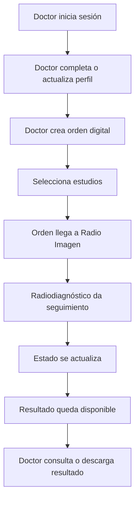

# PDR - Radio Imagen Dentomaxilar

## Objetivo del producto

Crear una plataforma para que doctores y clínicas puedan generar órdenes digitales de estudios radiológicos, mientras Radio Imagen/Radiodiagnóstico puede recibirlas, darles seguimiento operativo y actualizar su estado hasta que el resultado esté listo.

El producto reemplaza la dependencia de una orden física perdida o incompleta por un flujo digital trazable.

## Alcance actual

### Incluido

- Login del doctor con correo autorizado y contraseña (hash scrypt en el servidor). El alta de cuentas la hace el admin desde el panel.
- Perfil profesional del doctor.
- Imagen de perfil con ajuste de zoom y encuadre.
- Panel del doctor.
- Creación de orden digital.
- Selección de estudios solicitados.
- Fecha de remisión automática con opción de edición.
- Vista de órdenes referidas por el doctor.
- Popup para ver una orden específica.
- Consulta de resultados desde la vista del doctor.
- Métricas básicas del doctor/clínica.

### No incluido todavía

- Integración PACS.
- App móvil nativa.
- Agenda completa.
- Finanzas del doctor.
- Automatización avanzada de WhatsApp.
- Portal del paciente.
- Expediente clínico completo.

## Usuarios

### Doctor

Usuario principal de la primera etapa.

Necesita:

- Crear órdenes de estudios.
- Revisar sus órdenes enviadas.
- Consultar el estado de cada orden.
- Descargar o acceder a resultados cuando estén listos.
- Editar su perfil profesional.

### Radio Imagen / Radiodiagnóstico

Usuario operativo interno.

Necesita:

- Recibir órdenes generadas por doctores.
- Validar datos del paciente.
- Contactar o agendar al paciente.
- Actualizar el estado operativo de la orden.
- Subir o asociar resultados.
- Tener trazabilidad por doctor, paciente, estudio y fecha.

## Flujo funcional actual

## Estados de una orden

| Estado | Responsable | Descripción |
| --- | --- | --- |
| Recibida | Sistema / Radio Imagen | Orden creada por el doctor y visible para operación (estado inicial por defecto) |
| Agendada | Radio Imagen | Paciente ya tiene cita |
| Completa | Radio Imagen | Radio Imagen valida que el paciente acudió; suma puntos de Socios (`countsForPartner`) |
| Lista para descargar | Radio Imagen | Resultado disponible para el doctor |
| Cancelada | Radio Imagen | Orden no continúa |

> Estos son los 5 estados reales usados por `app.js`, `portal.html` y el valor por defecto `orders.status = 'Recibida'` en `db.js`.

## Reglas del producto

- Cada doctor solo debe ver sus propias órdenes.
- La fecha de remisión se autollenará con la fecha actual.
- El doctor puede modificar la fecha si está capturando una orden atrasada.
- Una orden puede contener uno o varios estudios.
- Radio Imagen debe conservar historial de cambios de estado.
- Los resultados pertenecen a una orden, no directamente al doctor.
- La imagen del perfil debe guardar archivo y datos de encuadre.

## Métricas iniciales

- Órdenes activas.
- Pacientes referidos por periodo.
- Pendientes de cita.
- Estudio más solicitado.
- Conversión de órdenes a estudios atendidos.
- Resultados listos pendientes de descarga.

## Criterios de aceptación

- Un doctor puede iniciar sesión y ver su panel.
- Un doctor puede crear una orden con paciente, fecha, estudios e indicaciones.
- La orden queda asociada al doctor correcto.
- El doctor puede abrir una orden específica desde “Ver orden”.
- Radio Imagen puede consultar órdenes por estado y doctor en el backend.
- El sistema puede calcular métricas por doctor, clínica y periodo.

